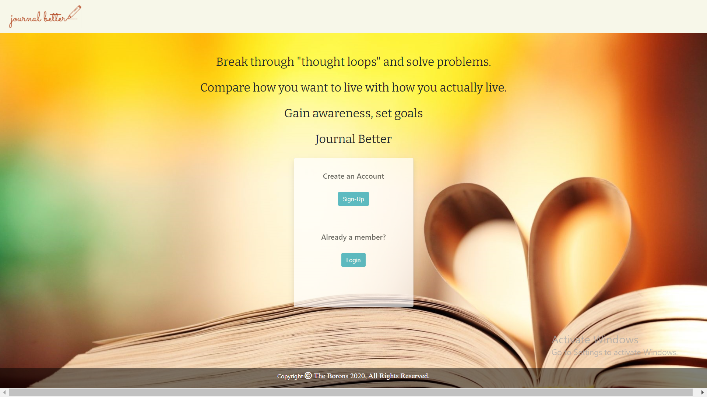

# Journal Better

## Description

Journal Better is a journaling app that allows the user to keep track of their specific goals for any day. They are given access to all seven days for that week, where they can organize how they will be spending their time, and edit whenever. At the end of the week, the user can reflect on how their week went, and if all goals were achieved, or if not, what can be done to do better going forward. Every jornal entry has an accurate date, for precise keeping, which can make looking back simple. Essentially, the user will get out what they put in, and every experience will differ.
  ## Table of Contents
  [installation](#Installation)
   
  [usage](#Usage)
   
  [contributions](#Contributions)
   
  [questions](#Questions)
   
  [license](#License)
 ## Installation

Journal Better is deployed on [Heroku](https://journal-better.herokuapp.com/).
 
## Usage
The image below shows the startup of the app. This is where the user will either `sign-up` or `login` to continue.
  

   
This page shows the current week, where the user can see notes they have made concerning plans they have made for those days as well as navigate directly to that day's journal entry. 
  

  
Today's Summary page is where the user can make notes about what they intend to do that day on the left. At the end of the day, they make notes on whether or not they did what they said they were going to and compare.
  

  
Once the user has compared the two and has their thoughts organized, it is time to journal. The journal can be saved by clicking on the Save Entry button at the bottom of the text area.
  

  
The history page allows the user to access past journal entries and read, edit, or delete them. 
  

  

## Questions

For any questions, contact us on any of the following links:

Email: 
* Jason Ozulumba cjozulumba@gmail.com, 
* Rayshawn Bay rbray.bray2@gmail.com
* Jonathan Peach jonmakesitbetter@gmail.com,
* Eduardo Pineda edibozu@gmail.com

Heroku: https://journal-better.herokuapp.com/

GitHub Repo: https://github.com/Edibozu/journal-better

## Contributions

This application was created by Jason Ozulumba,Rayshawn Bay, Jonathan Peach, and Eduardo Pineda. With contributions by our TA's, tutors, and BCS assistants. 

## License

MIT License

Copyright (c) [2020] [Jason Ozulumba, Rayshawn Bray, Jonathan Peach, & Eduardo Pineda]

Permission is hereby granted, free of charge, to any person obtaining a copy
of this software and associated documentation files (the "Software"), to deal
in the Software without restriction, including without limitation the rights
to use, copy, modify, merge, publish, distribute, sublicense, and/or sell
copies of the Software, and to permit persons to whom the Software is
furnished to do so, subject to the following conditions:

The above copyright notice and this permission notice shall be included in all
copies or substantial portions of the Software.

THE SOFTWARE IS PROVIDED "AS IS", WITHOUT WARRANTY OF ANY KIND, EXPRESS OR
IMPLIED, INCLUDING BUT NOT LIMITED TO THE WARRANTIES OF MERCHANTABILITY,
FITNESS FOR A PARTICULAR PURPOSE AND NONINFRINGEMENT. IN NO EVENT SHALL THE
AUTHORS OR COPYRIGHT HOLDERS BE LIABLE FOR ANY CLAIM, DAMAGES OR OTHER
LIABILITY, WHETHER IN AN ACTION OF CONTRACT, TORT OR OTHERWISE, ARISING FROM,
OUT OF OR IN CONNECTION WITH THE SOFTWARE OR THE USE OR OTHER DEALINGS IN THE
SOFTWARE.
